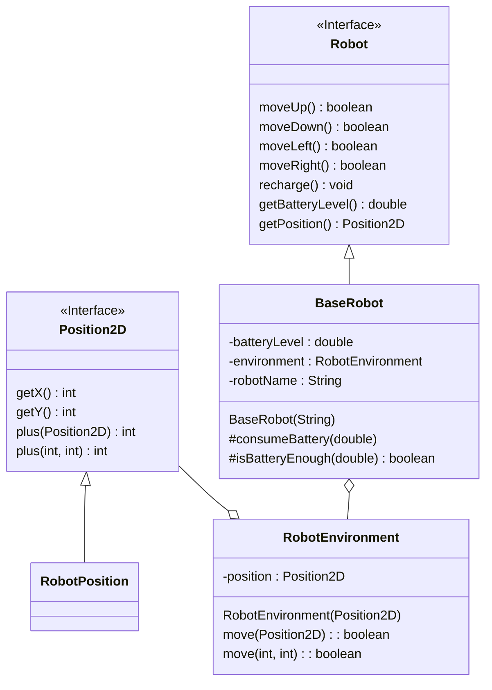
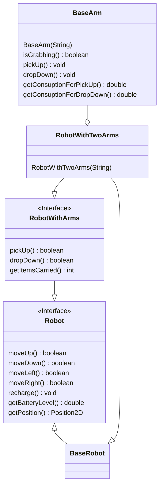

# Extension of existing software with provided design

Take a look at the contents of `it.unibo.oop.lab04.robot.base`. It contains classes and interfaces modeling a robot that can move into an environment.
Use the following UML to understand how the system is designed, and use `TestRobots` to better understand how it works.

https://mermaid.live/edit#pako:eNp1lE1rg0AQhv-KbC8G4qVHCTmE9FAIpSQUWvCy6qgL7o7shyWk-e_duBrXaPYk87zuvPOhF5JhDiQmWU2V2jNaSsoTEdjziYpphuJ1H2z-oig4Yop6CM4kUYRO8SZaJlFwENqJdlRBRwIcbplpHO_S3OWObDbvQoMsaAbbbfAUjE4c7crx_V1c_HZK0N_hKmBD8j728xhraqPC8YolaiPrW9hjV9-Aq8vLzbGFr8ZmShFroGJK9vgrnrEDFPoZO7KyWoQSsorKEixrkeWTendU2_6dD9BCbXmOJq1hohhqt_Sxv5Mqxwl7lUapd38Qz-6PYFwCi5f3ohPKG_qgHKzspCUT5QjvqUNHViN6yVAow6GvM3QGfAFTPXsTaMpqUEzbOJ-n53JScNP3yNp8bNd9x713_dWajnOydPHyyL3Vi2eGyZpwkJyy3H7ZncWE6Ao4JCS2jzkU1NQ6IYm4Wik1Gk9nkZFYSwNrYpqcauj_BSQuaK3g-g_oJU_W

Using (without modifying) the existing classes, and using the provided following UML design scheme,
create a new `interface RobotWithArms extends Robot` with:
* `boolean pickUp()`: picks an object, returns `true` if the action is successful
* `boolean dropDown()`: drops an object, returns `true` if the action is successful
* `int getCarriedItemsCount()`: returns the number of objects this robot is currently transporting

https://mermaid.live/edit#pako:eNqFk8FuwjAMhl-lymlI9LJjhZAG1SYkDgg27dJL2rhttCauEheEgHdfChTa0bKckny_Y_-2cmAJCmABSwpubSh5ZriKtOfWGmMkb3L0fW_GLZyPLfItKf_c4ZtR1vP943RQdFe06GSy0AQm5QlM_wPNI8-S9wjretzJcXwIuijOnq8-D5ereincwlf5MvJixAK47pIQd3qILSGlIbaWWd4LDSQ5Nxk4tkUp7iADmnFyzdgvYQuF4wKruICOYoVWksS6pGb7Gl4UpweXt3G03JYy-el3KwyWQ25d5gWBsnNujAThJFLTs7TNtFqZ_7KXDRmps1HPM80sW9HXq25QvaT9MDyO3WVf4Te73V63vD4MYY7aVmXd2Xc0qya-ZxYdYXh_sS11ttiYKTCKS-H-3dlRxCgHBREL3FZAyquCIhbpk5PyinCz1wkLyFQwZlUpOMH1p7Ig5YWF0y_j4DO1

Using (without modifying) the existing classes and the provided UML design scheme,
create a new `class BasicArm` which models a robotic arm.
Every arm can lift a single object at a time, and it requires some power to lift an object and some power to drop it down.

Using (without modifying) the existing classes and the provided UML design scheme,
create a new `class RobotWithTwoArms extends BaseRobot implements RobotWithArms` which models a robot with two arms.
When `pickUp()` is invoked, the robot lifts an object, raising the count of objects it is transporting, and occupying one of its arms.
When all the arms are occupied, `pickUp()` returns `false`.
Similarly, `dropDown()` returns `false` if the robot's arms are empty.
If the robot is transporting objects, its battery consumption is higher.

Use `TestRobotWithArms` to verify that the classes realized work correctly before calling the teacher for a correction.

# From application domain analysis to code

In this exercise, we will provide a description of the system (actually, of its *domain*) in natural language.
As an engineer, formalize this description by:

* Extract the entities, and map them to a hierarchy of interfaces. Usually, the entities that compose a domain (or problem) are nouns in natural language.
* Draw on paper the hierarchy of interfaces using the UML notation
* Enrich with methods representing the functionalities
* Take a design step: determine which entities must be concrete, and if some common concrete aspects can be summarized in abstract types
* Implement your solution in code

For the sake of simplicity, the problem description is provided in Italian:

### **Analisi del dominio**

Si desidera realizzare un *robot componibile*, ossia un robot al quale possono essere aggiunti o rimossi *componenti* arbitrari.

Un componente può essere acceso o spento.
Ogni componente può essere non connesso, oppure connesso ad un solo robot.
Il componente può compiere azioni sul robot.
Ciascun componente ha un proprio consumo di energia.

Il robot componibile espone una funzionalità che consente di mettere in moto e far funzionare tutti i componenti connessi, a patto ovviamente che siano accesi.
Quando tale funzionalità viene chiamata, il robot mette in esecuzione, per una sola volta, tutti i componenti ad esso connessi.
Quando il robot componibile fa uso di un componente, deve scalare dalla propria batteria il consumo di energia richiesto per l'azione.

Alcuni componenti sono in grado di supportare dei comandi, e prendono il nome di *componenti comandabili*.
Ciascun componente comandabile ha un proprio set di comandi supportati.
Il componente comandabile può ricevere un *comando*.
Alla ricezione del comando, se esso è fra quelli supportati, il componente comandabile modifica il proprio comportamento in maniera tale da eseguire il comando richiesto.

Si desidera testare l'infrastruttura creando un robot componibile ed assegnandogli i seguenti componenti:

* *Batteria atomica*. È un componente non comandabile, alimentato ad uranio-239, che ricarica istantaneamente il robot. In fase di test, per evitare il surriscaldamento, la batteria si attivi esclusivamente qualora la batteria del robot fosse al di sotto del 50% di carica.

* *Navigatore di confine*. È un componente non comandabile che, una volta avviato, fa sì che il robot raggiunga il bordo del `RobotEnvironment` e continui ad esplorarlo. Ossia, fa sì che il robot proceda in una direzione, fino ad arrivare al bordo, quindi ruoti di 90° e continui ad esplorare lungo il bordo, al raggiungimento di un nuovo bordo, si orienti in modo da poter proseguire l'esplorazione e prosegua.

* Due *braccia prensili*. Sono componenti comandabili, che supportano due comandi: *pick* e *drop*. Se è attivo il comando pick, e il braccio non ha oggetti in mano, allora viene preso un oggetto; se il braccio invece ha oggetti in mano, non viene effettuata alcuna azione. Se è attivo il comando drop, ed il braccio ha un oggetto in mano, allora l'oggetto viene lasciato; se il braccio invece non ha oggetti in mano, non viene eseguita alcuna azione.
